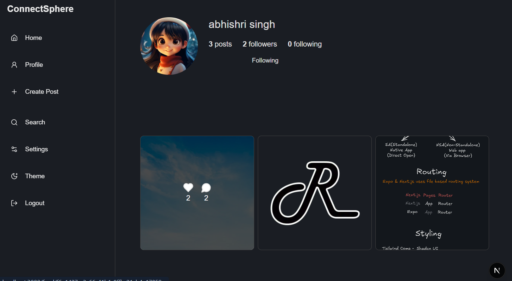

# Full-Stack Social Media web application with Next.js, Prisma, Neon PostgreSQL, and BetterAuth

A modern full-stack web application built with:

- **Framework**: Next.js 15 (App Router)
- **Runtime**: Bun
- **ORM**: Prisma + Accelerate
- **Database**: Neon PostgreSQL
- **Styling**: Tailwind CSS + shadcn/ui
- **Auth**: better-auth + argon2
- **Forms**: react-hook-form + zod
- **UI Enhancements**: lucide-react, sonner, embla-carousel
- **Email**: nodemailer

---




---

## Features

- Secure auth with `better-auth` and `argon2`
- Schema validation with `zod` + `react-hook-form`
- Accessible UI via `shadcn/ui`
- Image upload with `@imagekit/next`
- Email support via `nodemailer`

---

## Getting Started

### 1. Clone the repo

### 2. Install dependencies: bun install

### 3. Database Setup

This project uses PostgreSQL via Neon and Prisma ORM.

- Step 1: Create a Neon Database

- Step 2: Configure .env

```env
DATABASE_URL="postgresql://<username>:<password>@<host>:<port>/<database>?sslmode=require"
```

- Step 3: Push Prisma Schema

```bun

bunx prisma db push
```

- Step 4 (Optional): Open Prisma Studio

```bun

bunx prisma studio

```

### 4. Configure environment variables:

Create a .env file based on .env.example and Update the values.

### 5. Start the development server:

```bash
bun dev
```

The app will be available at http://localhost:3000


